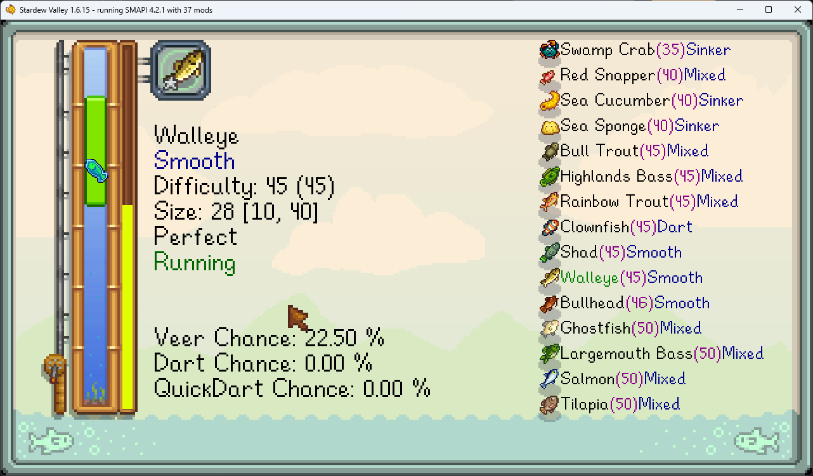
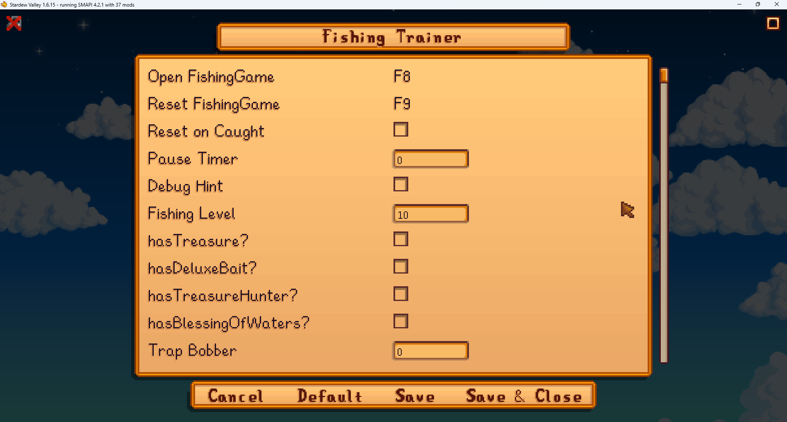
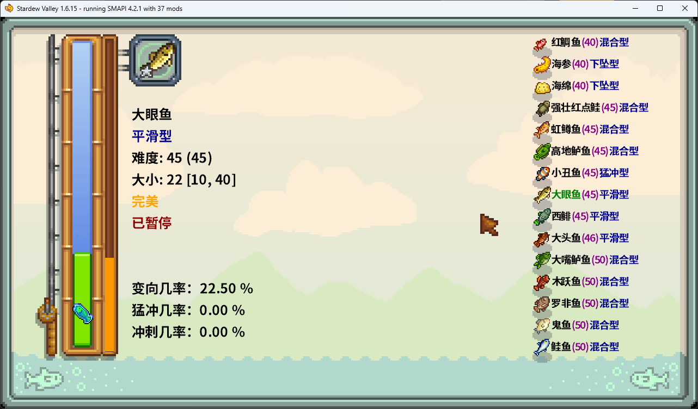
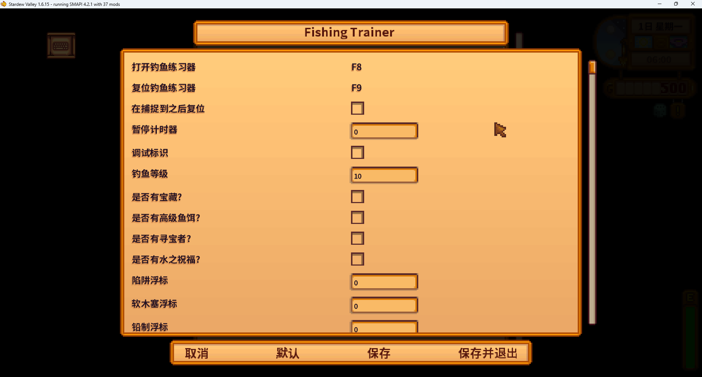

# Fishing Trainer

This mod provides a fishing training mechanism.

## Install

1. Download from [Nexus](https://www.nexusmods.com/stardewvalley/mods/34289).
2. Unzip and Put it in your `StardewValley/Mods` folder.
3. Press `F8` in game to open `FishingGame` menu.
4. Press `F9` in game to reset the `FishingGame` status.

## Config

1. Download `Generic Mod Config Menu` from [Nexus](https://www.nexusmods.com/stardewvalley/mods/5098).
2. Adapt what you want.

---

本模组提供一个钓鱼小游戏的模拟器，可以一直练习而不会失败。

## 安装

1. 从 [Nexus(34289)](https://www.nexusmods.com/stardewvalley/mods/34289) 上下载
2. 将 Mod 解压并放到 `StardewValley/Mods` 目录
3. 按 `F8` 打开练习器
4. 按 `F9` 复位练习器状态

## 配置

1. 从 [Nexus(5098)](https://www.nexusmods.com/stardewvalley/mods/5098) 上下载 `Generic Mod Config Menu`
2. 修改你需要的数据

